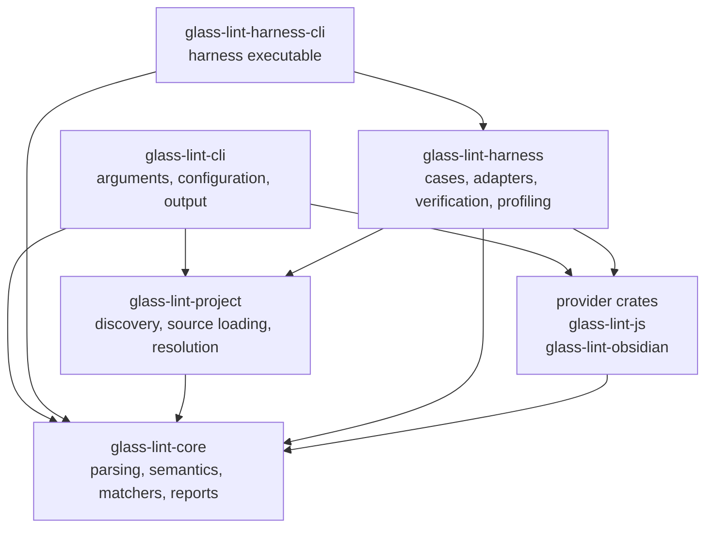

# Architecture

Glass Lint separates generic JavaScript analysis from provider policy. The
core parses and analyzes each file once, providers describe capabilities with
declarative matchers, and front ends select rules and serialize reports.

## Package boundaries



`glass-lint-project` is the filesystem adapter between the CLI and core. It
owns bounded discovery, source reads, project boundaries, tsconfig membership,
and Oxc resolution. Core receives only owned sources and explicit typed
resolution results, so it remains usable with virtual projects and has no
filesystem or resolver dependency.

### `glass-lint-core`

Core is provider-neutral. It owns:

- JavaScript/JSX and ordinary TypeScript parsing (`.js`, `.cjs`, `.mjs`,
  `.ts`, `.cts`, and `.mts`)
- lexical scopes, bindings, shadowing, and reassignment history
- import, CommonJS, global, rooted-chain, alias, and value provenance
- the shared semantic fact stream and bounded flow analysis
- matcher validation, normalization, compilation, and execution
- validated host-environment configuration for global bindings plus
  unrestricted current-realm and member-restricted foreign-realm global
  objects
- rule catalogs, rule selection, deterministic findings, and diagnostics

Core must not contain Obsidian module names, API knowledge, categories,
manifest fields, disclosure mappings, or profile policy. Likewise, generic
JavaScript, browser, Node.js, and Electron policy belongs in
`glass-lint-js`, not in core.

### Provider crates

`glass-lint-js` and `glass-lint-obsidian` construct rules through the public
matcher API and expose complete and recommended `Linter` configurations. A
provider owns its rule names, descriptions, confidence assignments,
categories, disclosures, and any narrowly scoped custom policy.

Rules should be declarative whenever the matcher API can express the intended
semantics accurately. Extend the generic matcher vocabulary when a behavior is
reusable. Provider-specific Rust callbacks are reserved for semantic rules
that cannot be represented faithfully as generic matchers.

Provider crates also own host assumptions. Core supplies a conservative
ECMAScript environment only; browser, Node.js, Electron, Obsidian, and other
runtime globals are declared by provider defaults and may be extended by
library callers. Environment configuration is attached to a `RuleCatalog` and
used by the shared semantic pass, not embedded in individual matchers.
Member-restricted global objects prevent APIs injected into one realm from
being inferred on another window-like realm.

When generic JavaScript and provider rules run as one profile, they share the
provider's host environment. Running the generic JavaScript catalog alone uses
only its own browser/Node/Electron default.

### Harness and CLI

`glass-lint-harness` loads annotated JavaScript cases, invokes built-in or
external adapters, checks diagnostic expectations, produces reports, and
profiles folders. It depends on providers to offer the built-in Glass Lint
adapter but does not implement lint semantics.

Project fixtures are either virtual inputs with explicit resolution records or
filesystem cases delegated to `glass-lint-project`. Project reports retain
sorted file-qualified primary locations and bounded evidence; project
diagnostics remain separate from rule severity and affect CLI status directly.
Project reports expose `completion` as `complete` or `partial`; deterministic
resource-limit exhaustion may retain completed file reports as partial
diagnostic output, while total-timeout failures discard the report.

`glass-lint-cli` is deliberately thin. It owns argument parsing, configuration,
project selection, human/JSON output, process exit behavior, and the
`glass-lint` executable; it delegates project discovery and resolution to
`glass-lint-project`. `glass-lint-harness-cli` owns the harness executable;
reusable harness behavior stays in `glass-lint-harness`.

## Per-file analysis pipeline

```text
source
  -> parse JavaScript/JSX or TypeScript once
  -> normalize TypeScript in memory (TypeScript only)
  -> collect lexical scopes and declarations
  -> emit matcher-independent semantic facts
  -> resolve identities, constants, aliases, calls, and value flow
  -> build shared indexes
  -> query compiled matchers for selected rules
  -> group bounded evidence into findings
  -> sort findings by location and rule ID
```

The selected rule set must not change semantic fact construction or add AST
traversals. Shared analysis is built once per file, then queried by every
enabled rule.

During parsing, TypeScript runs SWC's lexical resolver and fixed default
TypeScript transform. It strips type-only syntax and lowers runtime TypeScript
constructs in memory while retaining the original source map for findings.
The input boundary excludes TSX, declaration files, and `tsconfig.json` as
source. Glass Lint does not type-check or follow type-only dependencies.
Runtime module requests are resolved separately during project construction.

The main core layers are:

- `analysis/syntax`: small AST naming, constant, and provenance helpers
- `analysis/scope`: lexical model, collection, and binding/provenance queries
- `analysis/facts`: matcher-independent semantic events emitted from the AST
- `analysis/resolution`: expression, call, and constant resolution
- `analysis/value`: stable value identities and arenas
- `analysis/flow`: bounded state projection and summary-based flow matching
- `analysis/matching`: occurrence indexes and evidence queries
- `api/rule`: validated public rules and declarative matcher types
- `api/compiler`: immutable matcher plans compiled at catalog construction
- `lint`: catalog validation, rule selection, and report construction

## Multi-file project analysis

Multi-file analysis is a staged exchange between `glass-lint-project` and
`glass-lint-core`. The project crate decides which files exist and what module
requests mean; core decides what those linked modules prove semantically. This
keeps filesystem and resolver policy out of the analysis engine and permits
the same core API to analyze virtual projects with explicit resolution
records.

### 1. Select and expand the project

The filesystem loader accepts one of three selections:

- An **entry file** starts with that file and admits supported internal
  dependencies as they are discovered.
- A **directory** starts with every supported source below that directory,
  subject to exclusions and limits.
- A **`tsconfig.json`** starts with the runtime sources selected by `files`,
  `include`, `exclude`, inherited configuration, and project references. Its
  compiler configuration is also available to module resolution, including
  path aliases.

Before reading sources, the loader establishes a canonical project root. It
rejects selections outside that boundary and excludes configured directories,
declaration files, unsupported extensions, oversized sources, and—unless
enabled explicitly—symlink traversal. File, request, byte, and resolver work
are bounded.

Each admitted source is parsed and locally analyzed exactly once through a
`ProjectSession`. That pass produces both the ordinary semantic model and a
matcher-independent module interface: authored `import`, dynamic `import()`,
and `require()` requests; import bindings; exports and re-exports; exported
functions; and supported exported constant identities. A resolution request
is keyed by importer, request kind, and exact source range, so repeated
specifier text at different locations remains distinct.

The project crate resolves each request with Oxc and records a typed result:
internal source, external package, runtime builtin, missing target,
outside-project target, or unsupported target. A supported internal result is
queued for admission if it was not already loaded. This queue continues until
no new internal modules remain; request results are cached, and duplicate or
cyclic imports do not cause a file to be analyzed twice.

### 2. Link local semantic models

After discovery and resolution finish, core validates all project-relative
paths and ensures every resolution record corresponds to an authored request.
It assigns stable module IDs from sorted paths and builds a directed graph from
internal resolution results. Local scopes, values, facts, and source maps stay
partitioned by module; linking adds a qualified overlay rather than merging
lexical state across files.

Core resolves supported exports and re-exports to a bounded fixed point,
including cycles represented as strongly connected components. The resulting
overlay can connect an imported binding or namespace member to:

- an external package or builtin export;
- a proven global or static string exported through an internal module; or
- a qualified export or function in another project module.

That is what lets a provider matcher recognize an external API through local
aliases, re-export barrels, and supported wrapper shapes without treating a
same-named local value as equivalent. Dynamic or conflicting CommonJS export
shapes, ambiguous star exports, missing resolution information, and
non-converging or over-budget linking remain unknown.

### 3. Compose calls and object flow

Local analysis also extracts a matcher-independent `FunctionEffect` from each
file's canonical fact tape. An effect records parameter and property-path
copies, observable property and call uses, returns, local value roots, and
conservative invalidation. It contains no rule IDs or matcher decisions.

Once qualified function targets are known, project flow composes these effects
with a bounded monotone worklist. This allows supported source, requirement,
and sink paths to cross calls between modules while preserving the file and
fact identity of every event. Compiled object-flow matchers query the composed
states only after linking; selecting a rule therefore does not change effect
construction or add another AST traversal.

### 4. Report conservatively

Findings remain owned by the file containing their primary event. Related
evidence may point into other project files and always carries a
file-qualified source location. Files, findings, evidence, graph edges, and
diagnostics are emitted in deterministic order.

Parse failures are reported on their source file. Unresolved internal
requests, outside or unsupported targets, ambiguous exports, and exhausted
effect, graph, SCC, or qualified-flow budgets produce project diagnostics.
They are kept separate from rule severity and cause the affected cross-file
semantics to fail closed rather than being guessed. In particular,
qualified-flow exhaustion adds `flow_link_budget_exhausted` instead of making
an incomplete analysis look clean.

## Rules and profiles

Provider rule factories use local IDs such as `network.request`. A
`RuleCatalog` validates them and adds the provider namespace, producing IDs
such as `js:network.request`. Catalogs reject duplicate or malformed IDs.

Every rule declares a confidence level:

- `High` rules enter the provider's `recommended_linter()`.
- The provider's `heuristic_linter()` enables the complete catalog.

Confidence describes the strength of the matching mechanism, not the
importance of the detected behavior. A broad name-only matcher can still be
useful for discovery, but it must require an explicit heuristic opt-in. The
Obsidian-specific promotion policy is documented in
[`glass-lint-obsidian/ACCURACY.md`](glass-lint-obsidian/ACCURACY.md).

## Precision and failure behavior

The engine is precision-first:

- strict matches require lexical identity or supported provenance at the use
  position;
- unbound names are global only when the catalog environment declares them;
- local lookalikes and shadowed globals must not match;
- reassignment invalidates provenance from that point forward;
- dynamic or unsupported semantics fail closed;
- evidence and source sizes are bounded; and
- output ordering and source locations are deterministic.

These constraints are architectural invariants. A new matcher that cannot
prove identity should be explicitly named and classified as heuristic rather
than silently weakening a strict matcher.

## Public API design

The public extension path is `glass_lint_core::rules`: build validated rules,
place them in a namespaced `RuleCatalog`, and pass that catalog to `Linter`.
Internal AST, scope, fact, and index types remain private so providers cannot
couple themselves to a parallel analysis model.

Breaking changes are currently allowed when they simplify the design. A clean
break must update every workspace caller, fixture, adapter, schema consumer,
and document in the same change; compatibility wrappers are not retained by
default.
